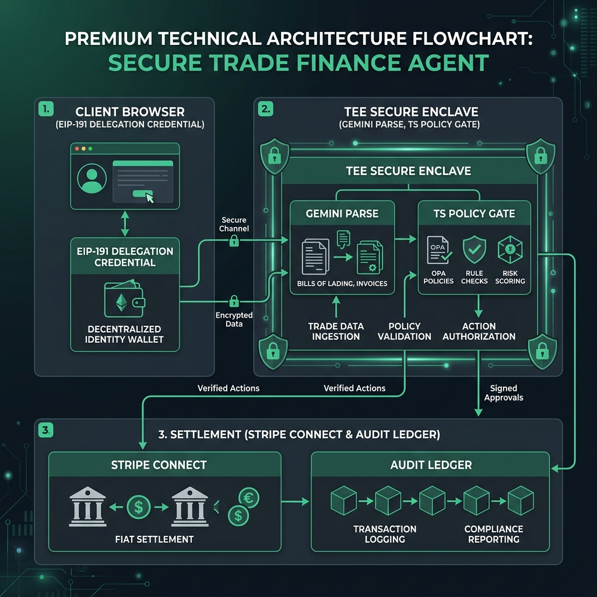

# 🚢 Autonomous TEE Trade Finance (Letter of Credit) Agent

[](https://terminal3.io)
[](https://nextjs.org)
[](https://stripe.com)
[](https://deepmind.google/technologies/gemini)
[](https://prisma.io)

An autonomous escrow agent for international trade finance executing **Letter of Credit (LC)** agreements. The agent locks a buyer's funds, verifies unstructured logistics webhooks, and securely releases payment to the exporter.

By executing the trade rules and payment resolution inside a secure **Trusted Execution Environment (TEE)** boundary via the **Terminal 3 Agent Auth SDK**, the agent never exposes sensitive keys or exporter destination accounts, and every state transition is recorded in an immutable cryptographic audit ledger.

---

## 🗺️ Architecture Overview

Our architecture splits execution into three strict security zones to ensure no sensitive hot keys or bank details escape the isolated TEE boundary:



1.  **Client Zone (Browser)**: The buyer uses their wallet to sign a contract delegation credential (EIP-191). This creates a secure, signed capability represented by an opaque placeholder. The agent never sees the buyer's private key.
2.  **TEE Enclave (Private Execution)**: When a Bill of Lading delivery webhook is received, the agent operates in hardware-isolated memory. It uses Google Gemini to parse the unstructured logistics data, feeding it into a deterministic TypeScript policy engine. The LLM acts purely as an advisor; the code remains the sole gatekeeper for funds.
3.  **Settlement Zone (Stripe & Ledger)**: If policy checks pass, the TEE agent resolves the opaque exporter placeholder to a real Stripe Connected Account ID and captures the escrow hold.

---

## 🛠️ Terminal 3 SDK Integration Points

For hackathon judging, here is exactly where the **Terminal 3 Agent Auth SDK** is implemented in the codebase:

*   **Connection & Handshake (`lib/t3/client.ts`)**: Initializes the SDK and loads WASM components required for secure metamorphic signatures and enclave handshake.
*   **Agent Identity Verification (`lib/t3/adk.ts#L80-L125`)**: Before executing privileged logic, the agent signs a challenge with its private key, resolving its registered Agent DID (`did:t3n:c9f6b88a...`) on-chain.
*   **Credential Minting (`lib/t3/adk.ts#L150-L200`)**: Captures the buyer's browser signature and packages it into a cryptographically signed Delegation Credential, returning an opaque `buyerPlaceholder`.
*   **TEE Resolution (`lib/t3/adk.ts#L280-L330`)**: Inside the isolated execution boundary, the agent builds a replay-resistant preimage containing the delegation ID, a secure nonce, and the release hash, signing it locally to authorize payout execution.
*   **Cryptographic Audit Write (`lib/t3/adk.ts#L380-L420`)**: Computes the SHA-256 block receipt hash and signs the state transition receipt using the agent DID.

---

## 🌟 Premium Visual & UX Features

*   **Dynamic Visual Inspector Drawer**: Inspecting any enclave milestone (like `policy.check`, `llm.parse`, or `payout.fire`) opens a visual side drawer displaying EIP-191 signatures, Gemini's parsed explanation, and policy check pass/fail markers.
*   **Zero-Configuration Stripe Connect**: If a new exporter is registered (e.g. `exporter-ref:royal-dutch-yarn-999`) and has no pre-mapped Stripe Connect ID, the agent automatically provisions a test-mode Custom Connected Account on-the-fly and caches it in `stripe_destinations_cache.json`.
*   **Interactive Enclave Panel**: Highlights milestones in emerald green or amber orange, with an interactive security topology diagram visualizing active boundaries.
*   **Custom Contracts & Policy Rules**: Toggle the creation modal to set customized required ports or max limit caps, making it easy to test policy gate violations.

---

## 🔬 Testing & Demo Scenarios

The project ships pre-seeded with three validation scenarios so you can test all policy gates instantly:

1.  **Scenario 1: Happy Path Settlement** (Rotterdam LC, $25,000 value, $50,000 cap) ➔ Webhook matches terms, Stripe captures funds and transfers to the Connect account successfully (**SETTLED**).
2.  **Scenario 2: Port Mismatch Denial** (Cargo targets Rotterdam, terms require Hamburg) ➔ The deterministic policy gate blocks execution (**FAILED**).
3.  **Scenario 3: Over Value Cap** (LC value $95,000 exceeds $50,000 cap) ➔ Rejects settlement automatically (**FAILED**).

---

## 🚀 Quick Start & Run Locally

### 1. Install Dependencies
```bash
npm install
```

### 2. Set Up Environment
Copy the example environment file:
```bash
cp .env.example .env.local
```
*Your registered Agent DID (`did:t3n:c9f6b88a...`) and private keys are pre-configured for instant sandbox testing.*

### 3. Initialize Database
Push schema and seed initial Letters of Credit:
```bash
npm run db:push
```
```bash
npm run db:seed
```

### 4. Run Development Server
```bash
npm run dev
```
Open [http://localhost:3000](http://localhost:3000) in your browser.

### 5. Run Integration Tests
Verify all gates, duplicate webhook protection, and signature checks:
```bash
npm run smoke:step5
```

---

## 📹 Video Presentation Kit
For video recording, slides, and case study data, check out:
*   [videoscript.md](./videoscript.md) — Spoken word-for-word script, visual cues, and industry case studies.
