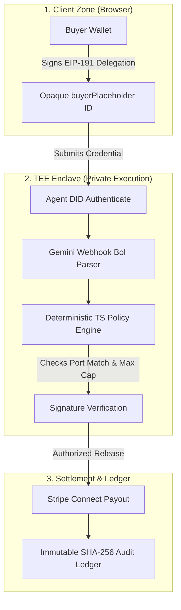

# Demo Video Script & Presentation Guide

This document contains case study data, visual cues, a relative flowchart, and a word-for-word voiceover script for the Trade Finance Escrow Agent hackathon demo.

---

## 1. Industry Context & Case Studies

When presenting the problem statement, highlight these real-world statistics to show the significance of the project:

*   **Inefficient Processing**: Letters of Credit secure **$10 Trillion** in trade annually (*ICC*), yet manual audits take **10 to 14 days** to clear.
*   **Documentation Errors**: Over **70% of physical transport documents** (Bills of Lading) contain discrepancies on first presentation, causing cargo demurrage fees at ports.
*   **The TEE Advantage**: Standard Web2 software agents expose Stripe/banking API keys in standard database environments. Moving the signature verification, LLM parsing, and payment release logic into a **Trusted Execution Environment (TEE)** ensures that even if the host server is compromised, hot keys and financial execution remain fully isolated.

---

## 2. Interactive Architecture Flowchart

Below is the visual topology diagram of the secure transaction lifecycle:

### Cryptographic Trust Boundaries (Mermaid Flowchart)

---

## 3. Word-for-Word Voiceover Script

*Read this script at a steady, professional pace. Match the spoken lines to the corresponding UI interactions on screen.*

### Introduction (0:00 - 0:40)
> *"Hello, everyone. Today, I'm excited to present our Autonomous Trade Finance Escrow Agent, powered by the Terminal 3 Agent Auth SDK. In global commerce, Letters of Credit secure over ten trillion dollars in trade, yet they remain slow, manual, and exposed to severe security risks. Standard software agents automate these workflows but require direct access to hot API keys and private bank details. If the host server is hacked, your funds are gone. Our solution moves the entire execution boundary into a hardware-isolated Trusted Execution Environment."*

### Architecture & Trust Boundaries (0:40 - 1:20)
> *"Let's examine how we achieve this. Our architecture is split into three strict security zones. In the Client Zone, the buyer signs a contract delegation credential in their browser using their wallet. This creates a secure, EIP-191 signed capability represented by an opaque placeholder. The agent never sees the buyer's private key. In the TEE Enclave, the agent operates in complete isolation. When port cargo webhooks arrive, the agent uses Google Gemini to parse the unstructured Bill of Lading, feeding it into a deterministic TypeScript policy engine. The LLM acts purely as an advisor; the code remains the sole validator."*

### Happy Path Demonstration (1:20 - 2:20)
> *"Let's demonstrate the happy path. We'll select our pre-seeded Rotterdam Letter of Credit. When I click 'Authorize Escrow', the agent intercepts the buyer's delegation and places a manual-capture Stripe hold on the buyer's card. Next, we simulate the port delivery. The webhook fires, the agent authenticates its registered DID, runs the policy checks, and inside the TEE boundary, resolves the payment to the exporter. As you can see, the transaction settles instantly. In the visual inspector side drawer, we can see the exact cryptographic proofs, including the verified buyer signatures and the Stripe Connect transfer receipt."*

### Edge Cases & Zero-Configuration (2:20 - 3:30)
> *"Our project covers two key advanced edge cases. First is Zero-Configuration Connect: if a new exporter is introduced without a pre-mapped destination, the agent dynamically provisions a test-mode Custom Connect account on Stripe and executes the transfer seamlessly, caching the ID locally. Second is Policy Enforcement: if the cargo is delivered to the wrong port or exceeds the value cap, the policy gate immediately denies the release. In the drawer checklist, judges can inspect exactly which condition failed. Finally, every single state transition is compiled into a block, hashed via SHA-256, and written to our immutable audit ledger. This ensures total auditability for compliance officers. Thank you."*
